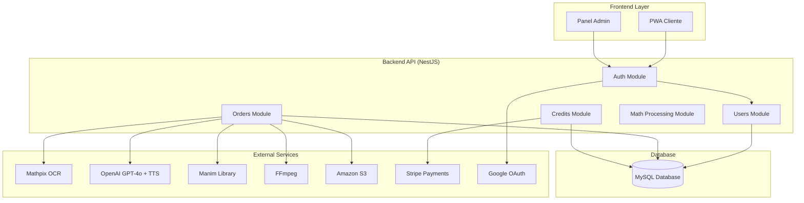
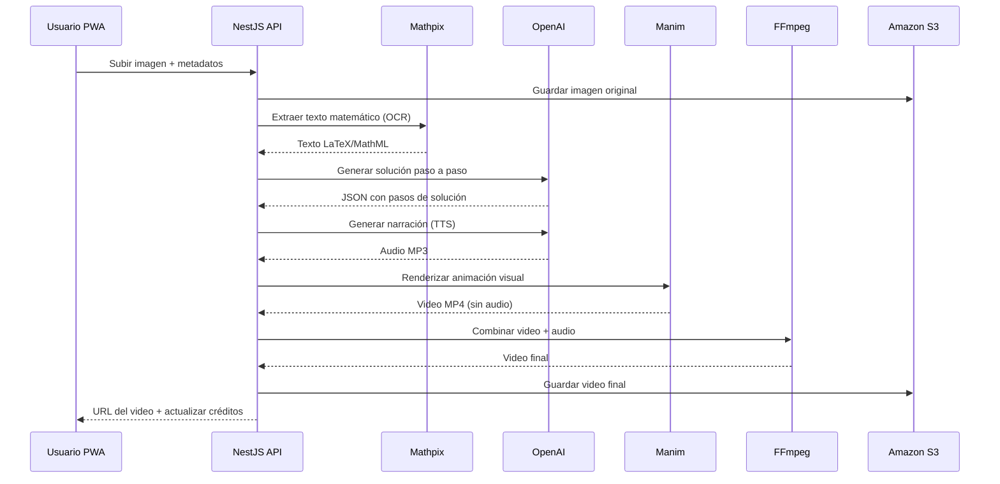
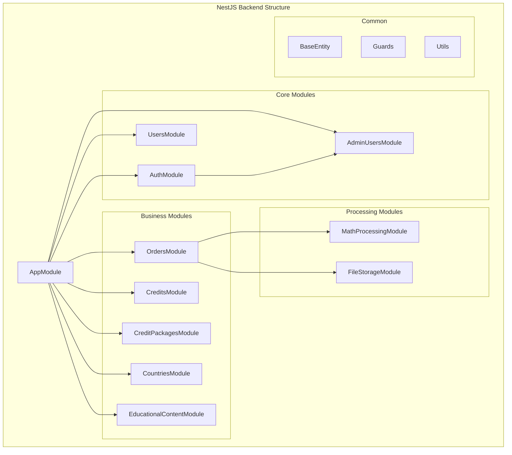
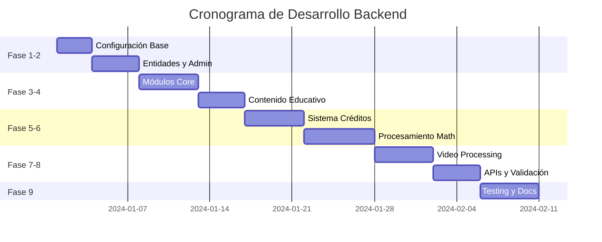

# Plan Arquitectónico - Sistema de Resolución Matemática por IA

## Descripción del Proyecto

Sistema backend desarrollado en NestJS que permite a usuarios PWA subir imágenes de problemas matemáticos para obtener soluciones paso a paso mediante IA, con generación de videos explicativos y sistema de créditos.

## Arquitectura General del Sistema



## Pipeline de Procesamiento Matemático



## Pila Tecnológica

### Backend
- **Framework**: NestJS con TypeScript
- **Base de Datos**: MySQL
- **ORM**: TypeORM
- **Autenticación PWA**: Google OAuth 2.0 → JWT
- **Autenticación Admin**: Usuario/Contraseña → JWT

### APIs Externas
- **Mathpix**: OCR de problemas matemáticos
- **OpenAI GPT-4o**: Generación de soluciones + TTS
- **Manim**: Renderizado de animaciones matemáticas
- **FFmpeg**: Ensamblaje de audio y video
- **Amazon S3**: Almacenamiento de archivos
- **Stripe**: Procesamiento de pagos

## Estructura de Módulos NestJS



## Estructura de Carpetas

```
src/
├── common/
│   ├── entities/
│   │   └── base.entity.ts
│   ├── enums/
│   ├── guards/
│   ├── decorators/
│   └── utils/
├── auth/
│   ├── strategies/
│   ├── guards/
│   ├── dto/
│   ├── auth.module.ts
│   ├── auth.service.ts
│   └── auth.controller.ts
├── admin-users/
│   ├── entities/
│   ├── enums/
│   ├── dto/
│   ├── admin-users.module.ts
│   ├── admin-users.service.ts
│   └── admin-users.controller.ts
├── users/
│   ├── entities/
│   ├── dto/
│   ├── users.module.ts
│   ├── users.service.ts
│   └── users.controller.ts
├── orders/
├── credits/
├── credit-packages/
├── countries/
├── educational-content/
├── math-processing/
├── file-storage/
├── config/
└── main.ts
```

## Entidades del Sistema

### BaseEntity
```typescript
@PrimaryGeneratedColumn('uuid')
id: string;

@CreateDateColumn({ name: 'created_at' })
createdAt: Date;

@UpdateDateColumn({ name: 'updated_at' })
updatedAt: Date;
```

### Entidades Principales

1. **AdminUserEntity** (admin_users)
   - username, password, email, name, role, isActive

2. **UserEntity** (pwa_users)
   - googleId, email, name, pictureUrl, countryOfOrigin, credits, isActive, role

3. **CountryEntity** (countries)
   - name, countryCode, isActive

4. **EducationalStageEntity** (educational_stages)
   - name, isActive, displayOrder, countryId

5. **EducationalSubdivisionEntity** (educational_subdivisions)
   - name, isActive, displayOrder, educationalStageId

6. **CreditPackageEntity** (credit_packages)
   - name, creditsAmount, price, currency, description, isActive, displayOrder

7. **OrderEntity** (orders)
   - code, userId, countrySelected, educationalStageSelected, subdivisionGradeSelected, topic, originalImageUrl, mathpixExtraction, openAiSolution, audioNarrationUrl, finalVideoUrl, status, errorMessage, creditsConsumed, completedAt

8. **CreditTransactionEntity** (credit_transactions)
   - targetUserId, adminUserId, action, amount, balanceBefore, balanceAfter, reason, paymentGateway, gatewayTransactionId, gatewayTransactionStatus, gatewayResponsePayload, creditPackageId

## Plan de Implementación

### **Fase 1: Configuración Base** ⚙️

#### 1.1 Inicialización del Proyecto
```bash
npx @nestjs/cli new sistema-matematica-ia-backend
cd sistema-matematica-ia-backend
```

#### 1.2 Instalación de Dependencias
```bash
# Core dependencies
npm install @nestjs/typeorm typeorm mysql2
npm install @nestjs/config
npm install class-validator class-transformer

# Authentication
npm install @nestjs/passport passport passport-local passport-jwt passport-google-oauth20
npm install @nestjs/jwt jsonwebtoken
npm install bcrypt @types/bcrypt

# Utilities
npm install uuid @types/uuid

# Development dependencies
npm install --save-dev @types/passport-local @types/passport-jwt @types/jsonwebtoken
```

#### 1.3 Variables de Entorno
```env
# Database
DB_TYPE=mysql
DB_HOST=localhost
DB_PORT=3306
DB_USERNAME=root
DB_PASSWORD=
DB_DATABASE=sistema_matematica_ia

# JWT
JWT_SECRET=your-super-secret-jwt-key
JWT_EXPIRATION_TIME=24h

# Google OAuth
GOOGLE_CLIENT_ID=
GOOGLE_CLIENT_SECRET=

# External APIs
MATHPIX_APP_ID=
MATHPIX_APP_KEY=
OPENAI_API_KEY=
AWS_ACCESS_KEY_ID=
AWS_SECRET_ACCESS_KEY=
AWS_S3_BUCKET=
STRIPE_SECRET_KEY=
```

#### 1.4 Configuración AppModule
- ConfigModule.forRoot()
- TypeOrmModule.forRootAsync() con MySQL
- Naming strategy para snake_case

#### 1.5 BaseEntity Común
```typescript
// src/common/entities/base.entity.ts
@PrimaryGeneratedColumn('uuid')
id: string;

@CreateDateColumn({ name: 'created_at' })
createdAt: Date;

@UpdateDateColumn({ name: 'updated_at' })
updatedAt: Date;
```

### **Fase 2: Módulo Admin y Autenticación** 👤

#### 2.1 AdminRole Enum
```typescript
// src/admin-users/enums/admin-role.enum.ts
export enum AdminRole {
  ADMINISTRATOR = 'ADMINISTRATOR'
}
```

#### 2.2 AdminUserEntity
```typescript
// src/admin-users/entities/admin-user.entity.ts
@Entity('admin_users')
export class AdminUserEntity extends BaseEntity {
  @Column({ unique: true })
  username: string;

  @Column()
  password: string;

  @Column()
  email: string;

  @Column()
  name: string;

  @Column({ type: 'enum', enum: AdminRole })
  role: AdminRole;

  @Column({ name: 'is_active', default: true })
  isActive: boolean;

  @BeforeInsert()
  @BeforeUpdate()
  async hashPassword() {
    if (this.password) {
      this.password = await bcrypt.hash(this.password, 10);
    }
  }
}
```

#### 2.3 Generación de Módulos
```bash
# AdminUsers Module
nest generate module admin-users
nest generate service admin-users/admin-users --no-spec
nest generate controller admin-users/admin-users --no-spec

# Auth Module
nest generate module auth
nest generate service auth/auth --no-spec
nest generate controller auth/auth --no-spec
```

#### 2.4 Estrategias de Passport
- LocalStrategy (src/auth/strategies/local.strategy.ts)
- JwtStrategy (src/auth/strategies/jwt.strategy.ts)

### **Fase 3: Módulos de Usuarios PWA** 👥

#### 3.1 UsersModule
```bash
nest generate module users
nest generate service users/users --no-spec
nest generate controller users/users --no-spec
```

#### 3.2 UserEntity
- Integración con Google OAuth
- Sistema de créditos
- Relaciones con órdenes

#### 3.3 GoogleStrategy
- Configuración OAuth 2.0
- Manejo de usuarios nuevos vs existentes

### **Fase 4: Contenido Educativo** 📚

#### 4.1 CountriesModule
```bash
nest generate module countries
nest generate service countries/countries --no-spec
nest generate controller countries/countries --no-spec
```

#### 4.2 Educational Content Modules
- EducationalStagesModule
- EducationalSubdivisionsModule
- Relaciones jerárquicas

### **Fase 5: Sistema de Créditos** 💳

#### 5.1 CreditPackagesModule
```bash
nest generate module credit-packages
nest generate service credit-packages/credit-packages --no-spec
nest generate controller credit-packages/credit-packages --no-spec
```

#### 5.2 CreditsModule
```bash
nest generate module credits
nest generate service credits/credits --no-spec
nest generate controller credits/credits --no-spec
```

#### 5.3 Integración con Stripe
- Webhooks de pagos
- Manejo de transacciones
- Historial de créditos

### **Fase 6: Procesamiento Matemático** 🧮

#### 6.1 OrdersModule
```bash
nest generate module orders
nest generate service orders/orders --no-spec
nest generate controller orders/orders --no-spec
```

#### 6.2 Estados de Órdenes
```typescript
export enum OrderStatus {
  PENDING = 'PENDING',
  PROCESSING = 'PROCESSING',
  COMPLETED = 'COMPLETED',
  FAILED = 'FAILED'
}
```

#### 6.3 MathProcessingModule
- Integración Mathpix (OCR)
- Integración OpenAI (Solución + TTS)
- Pipeline de procesamiento

#### 6.4 FileStorageModule
- Integración Amazon S3
- Gestión archivos temporales
- URLs firmadas

### **Fase 7: Integración Manim y FFmpeg** 🎬

#### 7.1 Video Processing Service
- Renderizado con Manim
- Ensamblaje con FFmpeg
- Optimización de videos

#### 7.2 Queue System
- Procesamiento asíncrono
- Manejo de errores
- Reintentos automáticos

### **Fase 8: APIs y Validación** 📡

#### 8.1 DTOs Completos
- Validación con class-validator
- Transformación con class-transformer
- Documentación Swagger

#### 8.2 Guards y Middleware
- JwtAuthGuard
- RolesGuard
- Rate limiting

#### 8.3 Exception Handling
- Global exception filter
- Logging estructurado
- Error responses consistentes

### **Fase 9: Testing y Documentación** 🧪

#### 9.1 Unit Tests
- Servicios críticos
- Mocking dependencias externas
- Coverage mínimo 80%

#### 9.2 Integration Tests
- Endpoints principales
- Base de datos
- APIs externas

#### 9.3 E2E Tests
- Flujos completos
- Autenticación
- Procesamiento matemático

#### 9.4 Documentación
- Swagger/OpenAPI
- README detallado
- Guías de deployment

## Cronograma Estimado



## Consideraciones Técnicas

### Seguridad
- Validación exhaustiva de inputs
- Rate limiting por usuario
- Sanitización de archivos subidos
- Encriptación de datos sensibles

### Performance
- Caching con Redis
- Optimización de queries
- Compresión de archivos
- CDN para videos

### Escalabilidad
- Arquitectura modular
- Queue system para procesamiento
- Load balancing
- Database sharding

### Monitoreo
- Health checks
- Métricas de performance
- Logging centralizado
- Alertas automáticas

## Deployment

### Containerización
```dockerfile
# Dockerfile para producción
FROM node:18-alpine
WORKDIR /app
COPY package*.json ./
RUN npm ci --only=production
COPY dist ./dist
EXPOSE 3000
CMD ["node", "dist/main"]
```

### Docker Compose
```yaml
version: '3.8'
services:
  app:
    build: .
    ports:
      - "3000:3000"
    environment:
      - NODE_ENV=production
    depends_on:
      - mysql
      - redis
  
  mysql:
    image: mysql:8.0
    environment:
      MYSQL_ROOT_PASSWORD: password
      MYSQL_DATABASE: sistema_matematica_ia
    
  redis:
    image: redis:alpine
```

### CI/CD Pipeline
- GitHub Actions
- Automated testing
- Docker build y push
- Deployment automático

## Próximos Pasos

1. **Implementar Fase 1**: Configuración base del proyecto
2. **Configurar Base de Datos**: MySQL con TypeORM
3. **Desarrollar Autenticación**: Admin y PWA users
4. **Integrar APIs Externas**: Mathpix, OpenAI, S3
5. **Implementar Pipeline**: Procesamiento matemático completo
6. **Testing Exhaustivo**: Unit, integration y E2E tests
7. **Deployment**: Configuración de producción

---

**Fecha de Creación**: 6/12/2025  
**Versión**: 1.0  
**Estado**: Planificación Completa