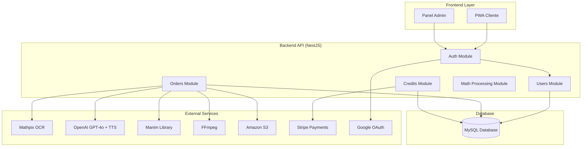
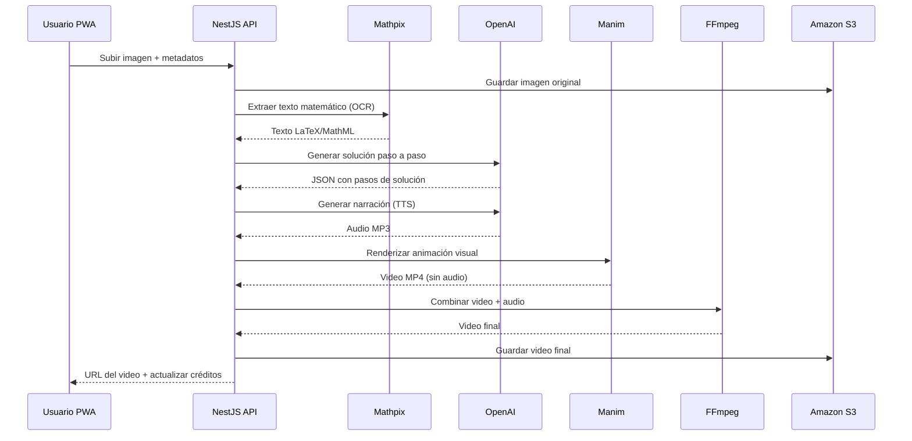
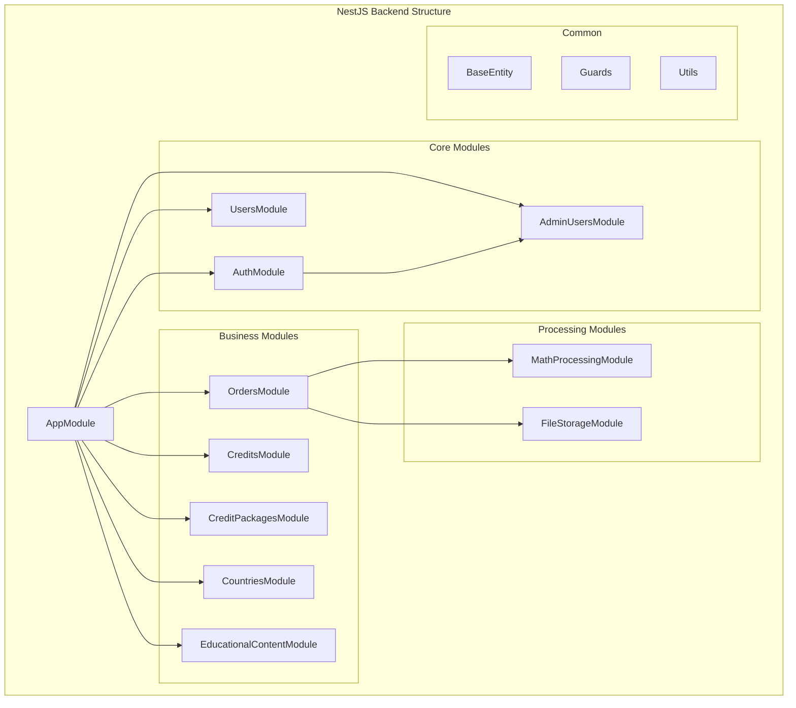

# Plan Arquitectónico - Sistema de Resolución Matemática por IA

## Descripción del Proyecto

Sistema backend desarrollado en NestJS que permite a usuarios PWA subir imágenes de problemas matemáticos para obtener soluciones paso a paso mediante IA, con generación de videos explicativos y sistema de créditos.

## Arquitectura General del Sistema


```mermaid
graph TB
    subgraph "Frontend Layer"
        PWA[PWA Cliente]
        ADMIN[Panel Admin]
    end

    subgraph "Backend API (NestJS)"
        AUTH[Auth Module]
        USER[Users Module]
        ORDER[Orders Module]
        CREDIT[Credits Module]
        MATH[Math Processing Module]
    end

    subgraph "External Services"
        MATHPIX[Mathpix OCR]
        OPENAI[OpenAI GPT-4o + TTS]
        MANIM[Manim Library]
        FFMPEG[FFmpeg]
        S3[Amazon S3]
        STRIPE[Stripe Payments]
        GOOGLE[Google OAuth]
    end

    subgraph "Database"
        MYSQL[(MySQL Database)]
    end

    PWA --> AUTH
    ADMIN --> AUTH
    AUTH --> USER
    ORDER --> MATHPIX
    ORDER --> OPENAI
    ORDER --> MANIM
    ORDER --> FFMPEG
    ORDER --> S3
    CREDIT --> STRIPE
    AUTH --> GOOGLE

    USER --> MYSQL
    ORDER --> MYSQL
    CREDIT --> MYSQL
```

## Pipeline de Procesamiento Matemático


```mermaid
sequenceDiagram
    participant U as Usuario PWA
    participant API as NestJS API
    participant MP as Mathpix
    participant AI as OpenAI
    participant MN as Manim
    participant FF as FFmpeg
    participant S3 as Amazon S3

    U->>API: Subir imagen + metadatos
    API->>S3: Guardar imagen original
    API->>MP: Extraer texto matemático (OCR)
    MP-->>API: Texto LaTeX/MathML
    API->>AI: Generar solución paso a paso
    AI-->>API: JSON con pasos de solución
    API->>AI: Generar narración (TTS)
    AI-->>API: Audio MP3
    API->>MN: Renderizar animación visual
    MN-->>API: Video MP4 (sin audio)
    API->>FF: Combinar video + audio
    FF-->>API: Video final
    API->>S3: Guardar video final
    API-->>U: URL del video + actualizar créditos
```

## Pila Tecnológica

### Backend

- **Framework**: NestJS con TypeScript
- **Base de Datos**: MySQL
- **ORM**: TypeORM
- **Autenticación PWA**: Google OAuth 2.0 → JWT
- **Autenticación Admin**: Usuario/Contraseña → JWT

### APIs Externas

- **Mathpix**: OCR de problemas matemáticos
- **OpenAI GPT-4o**: Generación de soluciones + TTS
- **Manim**: Renderizado de animaciones matemáticas
- **FFmpeg**: Ensamblaje de audio y video
- **Amazon S3**: Almacenamiento de archivos
- **Stripe**: Procesamiento de pagos

## Estructura de Módulos NestJS


```mermaid
graph TB
    subgraph "NestJS Backend Structure"
        APP[AppModule]

        subgraph "Core Modules"
            AUTH[AuthModule]
            ADMIN[AdminUsersModule]
            USERS[UsersModule]
        end

        subgraph "Business Modules"
            ORDERS[OrdersModule]
            CREDITS[CreditsModule]
            PACKAGES[CreditPackagesModule]
            COUNTRIES[CountriesModule]
            EDU[EducationalContentModule]
        end

        subgraph "Processing Modules"
            MATH[MathProcessingModule]
            FILES[FileStorageModule]
        end

        subgraph "Common"
            BASE[BaseEntity]
            GUARDS[Guards]
            UTILS[Utils]
        end
    end

    APP --> AUTH
    APP --> ADMIN
    APP --> USERS
    APP --> ORDERS
    APP --> CREDITS
    APP --> PACKAGES
    APP --> COUNTRIES
    APP --> EDU
    AUTH --> ADMIN
    ORDERS --> MATH
    ORDERS --> FILES
```

## Estructura de Carpetas

```
src/
├── common/
│   ├── entities/
│   │   └── base.entity.ts
│   ├── enums/
│   ├── guards/
│   ├── decorators/
│   └── utils/
├── auth/
│   ├── strategies/
│   ├── guards/
│   ├── dto/
│   ├── auth.module.ts
│   ├── auth.service.ts
│   └── auth.controller.ts
├── admin-users/
│   ├── entities/
│   ├── enums/
│   ├── dto/
│   ├── admin-users.module.ts
│   ├── admin-users.service.ts
│   └── admin-users.controller.ts
├── users/
│   ├── entities/
│   ├── dto/
│   ├── users.module.ts
│   ├── users.service.ts
│   └── users.controller.ts
├── orders/
├── credits/
├── credit-packages/
├── countries/
├── educational-content/
├── math-processing/
├── file-storage/
├── config/
└── main.ts
```

## Entidades del Sistema

### BaseEntity

```typescript
@PrimaryGeneratedColumn('uuid')
id: string;

@CreateDateColumn({ name: 'created_at' })
createdAt: Date;

@UpdateDateColumn({ name: 'updated_at' })
updatedAt: Date;
```

### Entidades Principales

1. **AdminUserEntity** (admin_users)

   - username, password, email, name, role, isActive

2. **UserEntity** (pwa_users)

   - googleId, email, name, pictureUrl, countryOfOrigin, credits, isActive, role

3. **CountryEntity** (countries)

   - name, countryCode, isActive

4. **EducationalStageEntity** (educational_stages)

   - name, isActive, displayOrder, countryId

5. **EducationalSubdivisionEntity** (educational_subdivisions)

   - name, isActive, displayOrder, educationalStageId

6. **CreditPackageEntity** (credit_packages)

   - name, creditsAmount, price, currency, description, isActive, displayOrder

7. **OrderEntity** (orders)

   - code, userId, countrySelected, educationalStageSelected, subdivisionGradeSelected, topic, originalImageUrl, mathpixExtraction, openAiSolution, audioNarrationUrl, finalVideoUrl, status, errorMessage, creditsConsumed, completedAt

8. **CreditTransactionEntity** (credit_transactions)
   - targetUserId, adminUserId, action, amount, balanceBefore, balanceAfter, reason, paymentGateway, gatewayTransactionId, gatewayTransactionStatus, gatewayResponsePayload, creditPackageId

---

**Fecha de Creación**: 6/12/2025  
**Versión**: 1.0  
**Estado**: Planificación Completa
